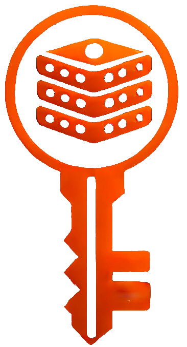

# CryptVault - 0Trust Vault on demand

## What is CryptVault?
Simply put, the CryptVault is a normal vault system. 

In other words, a system for sharing information between multiple systems.

<a href="https://cryptvault.cloud" target="_blank">Checkout webpage for more Information!</a>

On Github you will find all code open projects as a part of CryptVault.

